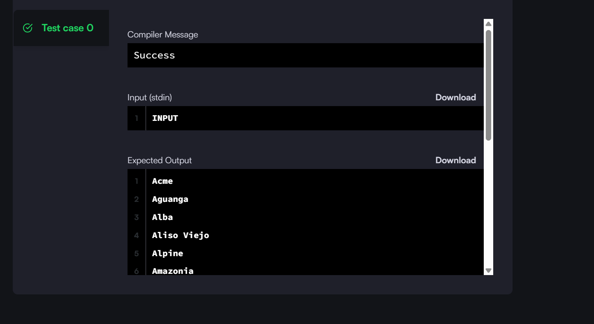
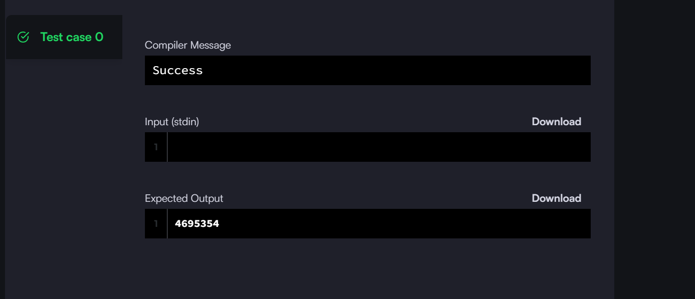
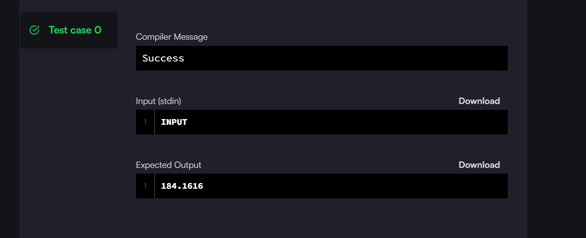
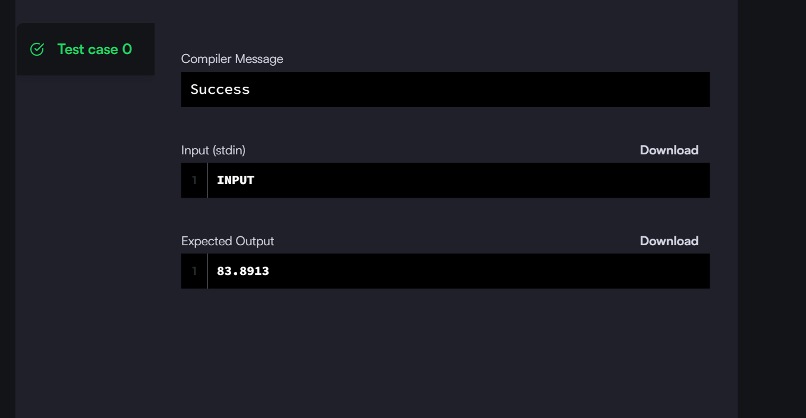
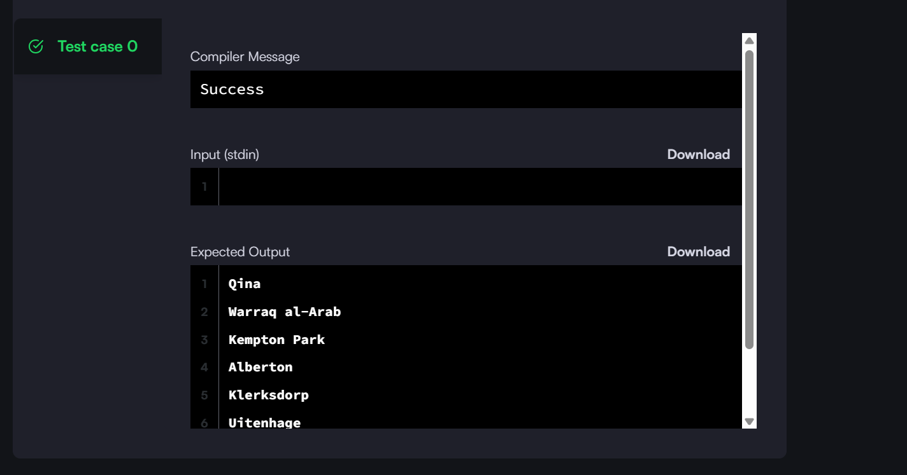
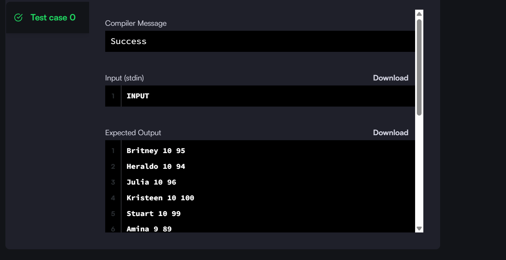
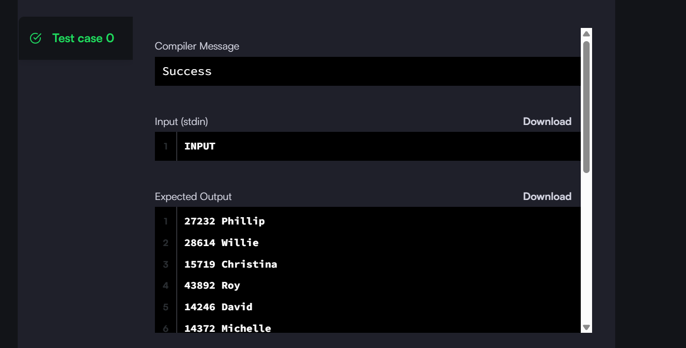

# DE004 Assignment

## 1. Weather Observation Station 8 : Query the two cities in STATION with the shortest and longest CITY names, as well as their respective lengths

This the solution code and screenshot

## Screenshot

## Solution code 
see [`Weather Observation station 8`](01_Weather-Observation-Station-8.sql) for the code
## 2. Population Density Difernece : Query the difference between the maximum and minimum populations in CITY.

This the solution code and screenshot

## Screenshot

## Solution code 
see [`02_Population_Density_Diference`](02_Population_Density_Difernece.sql) for the code

## 3. Weather Observation Station 19 : Query the Euclidean Distance between points and and format your answer to display decimal digits.

This the solution code and screenshot

## Screenshot

## Solution code 
see [`03_Weather_Observation_station_19`](03_Weather_Observation_Station_19.sql) for the code

## 4. Weather Observation Station 20 :Query the median of the Northern Latitudes (LAT_N) from STATION and round your answer to decimal places.

This the solution code and screenshot

## Screenshot

## Solution code 
see [`04_Weather_Observation_station_20`](04_Weather_Observation_Station_20.sql) for the code

## 5. African Cities : Query the names of all cities where the CONTINENT is 'Africa'.

This the solution code and screenshot

## Screenshot

## Solution code 
see [`05_African_Cities`](05_African_Cities.sql) for the code
## 6. African Cities : Query the names of all cities where the CONTINENT is 'Africa'.

This the solution code and screenshot

## Screenshot

## Solution code 
see [`06_African_Cities`](06_African_Cities.sql) for the code

## 7. Report : Write a SQL Query to create a report

This the solution code and screenshot

## Screenshot

## Solution code 
see [`07_Report`](07_Report.sql) for the code

## 8.Top Compettitors : Write SQL Query to find out top competitors

This the solution code and screenshot

## Screenshot

## Solution code 
see [`08_Top_Compettitors.sql`](08_Top_Compettitors.sql) for the code
